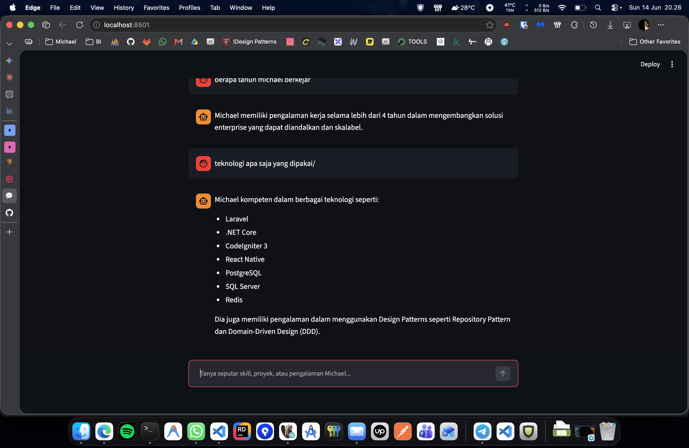
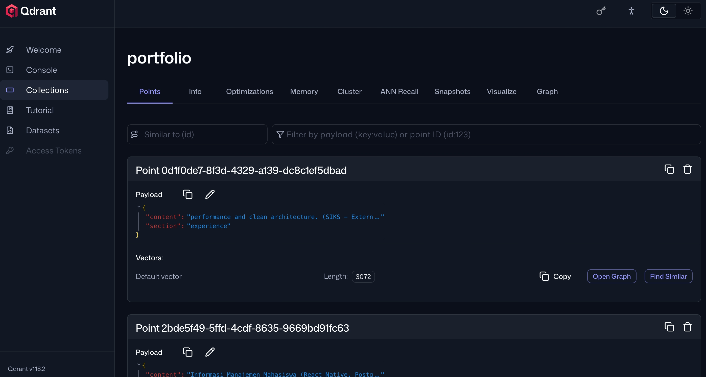

# Portfolio Chatbot — RAG-Powered AI Assistant

> Final Project | Hacktiv8  
> Michael Araona Wily — [michaelaraona.web.id](https://michaelaraona.web.id)

---

## Deskripsi

Portfolio Chatbot adalah AI assistant berbasis **Retrieval-Augmented Generation (RAG)** yang memungkinkan pengunjung portofolio untuk bertanya seputar skill, pengalaman, dan proyek secara interaktif. Chatbot hanya menjawab pertanyaan yang relevan dengan konten portofolio — pertanyaan di luar konteks akan ditolak secara otomatis.

---

## Arsitektur

```
User (Static Site)
    ↓ iframe embed
Streamlit App (Self-hosted di CapRover)
    ↓ embed query
Google Gemini Embedding API (gemini-embedding-001)
    ↓ vector search
Qdrant Vector DB (Self-hosted di CapRover)
    ↓ relevant chunks → build prompt
Groq API — LLaMA 3.1 8B Instant
    ↓
Jawaban ke User
```

---

## Tech Stack

| Komponen      | Teknologi                                        |
| ------------- | ------------------------------------------------ |
| UI Chatbot    | Streamlit                                        |
| LLM           | Groq `llama-3.1-8b-instant` (free tier)          |
| Embedding     | Google Gemini `gemini-embedding-001` (AI Studio) |
| Vector DB     | Qdrant (self-hosted)                             |
| HTML Parser   | BeautifulSoup4                                   |
| Text Splitter | LangChain `RecursiveCharacterTextSplitter`       |
| Static Site   | Cloudflare Pages                                 |
| Deployment    | CapRover (VPS)                                   |
| HTTP Client   | Python `requests`                                |

---

## Struktur Project

```
portfolio-chatbot/
├── .streamlit/
│   └── secrets.toml        # API keys (tidak di-commit)
├── .env                    # Environment variables lokal
├── app.py                  # Streamlit chatbot UI
├── indexer.py              # Script indexing HTML ke Qdrant
├── retriever.py            # RAG retrieval logic
├── qdrant_rest.py          # Qdrant REST client (wrapper requests)
├── reindex.sh              # Script shortcut re-indexing
├── requirements.txt        # Python dependencies
├── Dockerfile              # Docker image untuk CapRover
└── portfolio.html          # File HTML portofolio (sumber data)
```

---

## Cara Kerja

### 1. Indexing Pipeline

Dijalankan sekali (atau setiap ada update HTML portofolio):

```
portfolio.html
    → BeautifulSoup (parse + strip tag tidak relevan)
    → RecursiveCharacterTextSplitter (chunk 400 token, overlap 40)
    → Google Gemini Embedding API (dimensi 3072)
    → Qdrant Vector DB (collection: portfolio)
```

### 2. Query Pipeline

Setiap kali user mengirim pesan:

```
User input
    → Google Gemini Embedding (task: RETRIEVAL_QUERY)
    → Qdrant similarity search (cosine, threshold 0.45, top-4)
    → Build prompt (system + context + history)
    → Groq LLaMA 3.1 (streaming response)
    → Tampil di Streamlit UI
```

### 3. Out-of-Scope Guard

- Jika similarity score semua chunk < 0.45 → tidak ada context → chatbot menolak menjawab
- System prompt melarang LLM menjawab di luar konteks portofolio

---

## Instalasi & Setup Lokal

### Prerequisites

- Python 3.11
- Docker
- API key: Google AI Studio, Groq

### 1. Clone & setup environment

```bash
git clone <repo-url>
cd portfolio-chatbot

python -m venv venv
source venv/bin/activate
pip install -r requirements.txt
```

### 2. Konfigurasi secrets

Buat file `.streamlit/secrets.toml`:

```toml
GOOGLE_API_KEY = "your_google_aistudio_key"
GROQ_API_KEY   = "your_groq_key"
QDRANT_URL     = "http://localhost:6333"
QDRANT_API_KEY = ""
```

Buat file `.env`:

```
GOOGLE_API_KEY=your_google_aistudio_key
QDRANT_URL=http://localhost:6333
QDRANT_API_KEY=
```

### 3. Jalankan Qdrant via Docker

```bash
docker run -d -p 6333:6333 -p 6334:6334 \
  -v $(pwd)/qdrant_storage:/qdrant/storage \
  qdrant/qdrant
```

Verifikasi: buka `http://localhost:6333/dashboard`

### 4. Index HTML portofolio

Taruh file `portfolio.html` di root project, lalu:

```bash
python indexer.py
```

Output sukses:

```
Create collection result: {'result': True, 'status': 'ok', ...}
✅ Indexed N chunks.
```

### 5. Jalankan Streamlit

```bash
streamlit run app.py
```

Buka `http://localhost:8501`

---

## Deployment ke CapRover (Production)

### Qdrant

Di CapRover → One-Click Apps → deploy dengan image:

```
qdrant/qdrant
```

Port: `6333`. Enable HTTPS via CapRover.

### Streamlit App

Dockerfile:

```dockerfile
FROM python:3.11-slim
WORKDIR /app
COPY requirements.txt .
RUN pip install -r requirements.txt
COPY . .
EXPOSE 8501
CMD ["streamlit", "run", "app.py", \
     "--server.port=8501", \
     "--server.address=0.0.0.0", \
     "--server.headless=true"]
```

Push ke CapRover, set environment variables di dashboard:

```
GOOGLE_API_KEY=...
GROQ_API_KEY=...
QDRANT_URL=https://your-qdrant.domain.com
QDRANT_API_KEY=...
```

## Re-indexing

Setiap ada perubahan `portfolio.html`, jalankan:

```bash
./reindex.sh
```

Atau manual:

```bash
source venv/bin/activate
python indexer.py
```

---

## Dependencies

```
streamlit
groq
google-genai
beautifulsoup4
langchain
langchain-text-splitters
requests
python-dotenv
```

---

## Catatan Teknis

- `qdrant-client` diganti dengan custom REST wrapper (`qdrant_rest.py`) karena incompatibility `httpx` SSL handshake di environment tertentu
- Google Embedding model: `gemini-embedding-001` (dimensi 3072, bukan `text-embedding-004`)
- Groq free tier: rate limit 30 req/menit, cukup untuk demo
- Similarity threshold `0.45` — turunkan jika chatbot terlalu sering menolak, naikkan jika jawaban kurang relevan

---

## Tampilan & Dokumentasi

Berikut adalah beberapa tampilan antarmuka dan dashboard dari sistem Portfolio Chatbot yang berjalan di lingkungan production:

### 1. Antarmuka Chatbot (Streamlit UI)

_Chatbot yang di-embed menggunakan iframe pada website portofolio utama, lengkap dengan fitur streaming response dan pembatasan context (Out-of-Scope Guard)._



### 2. Dashboard Qdrant Vector DB (Self-hosted)

_Koleksi vektor `portfolio` yang menyimpan text chunks hasil indexing dokumen `portfolio.html` beserta koordinat embedding-nya._


